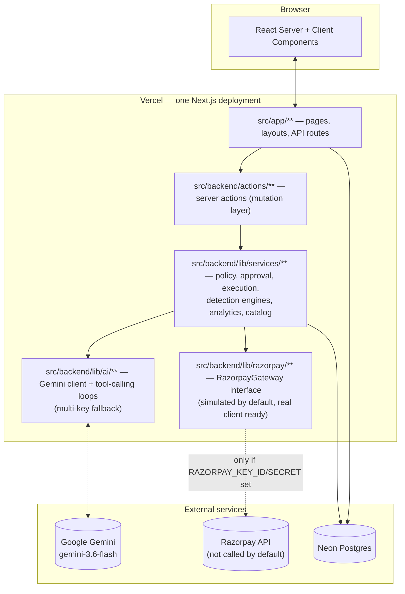

# Architecture — Vriddhi

> Written retroactively at Phase 24 against the actual shipped system —
> see `docs/PRD.md` §5 for where this deviates from the original Phase
> 0/3 plan and why.

## System overview

One Next.js application, one deployment (Vercel), one Postgres database
(Neon in production). There is no separate backend service — see
`README.md`'s "Project structure" section for why, and for the
frontend/backend folder grouping used *within* that single app
(`src/frontend/`, `src/backend/`, and `src/app/` which Next.js requires
to stay exactly where it is).

## The safety spine — the actual differentiator

The product's core claim is "the LLM can suggest, but it can't spend."
That's enforced structurally, not by prompt instructions, at four
independent layers:

1. **Tool input schemas.** `create_campaign`'s Zod schema accepts only
   `{ opportunityId: string }` — there is no field for the model to put a
   discount amount or cost into, even if it tried. The real numbers are
   always re-read from the `Opportunity` row a deterministic engine wrote
   (`src/backend/lib/ai/tools/propose-tools.ts`). Proven in
   `tests/tool-safety.test.ts` by literally attempting to smuggle
   `discountPerCustomer: 999999900` into the tool call and confirming the
   resulting campaign used the real numbers instead.
2. **The policy engine.** `evaluatePolicy()` is a pure, deterministic
   function with zero LLM involvement, called three separate times for
   the same campaign: at draft, at approval, and at execution — using the
   merchant's *current* limits each time, not a cached value from draft
   time. A merchant tightening a limit between approval and execution
   will still block the execution.
3. **The approval gate.** Every Campaign is created in `DRAFT` status.
   Nothing transitions it to `APPROVED` except a human clicking
   Approve/Modify in the browser (`approval-engine.ts`), which writes an
   immutable `Approval` row (`previousState`/`approvedState` JSON
   snapshots) alongside the status change, in one transaction.
4. **The execution chokepoint.** `executeApprovedCampaign()` is the *only*
   function anywhere in the codebase that calls
   `getRazorpayGateway().createPaymentLink()`. It halts at the first
   failure rather than continuing past it, reconciles with the gateway
   before concluding anything failed (a network timeout doesn't prove
   nothing happened), and a retry only ever touches targets that aren't
   already `LINK_CREATED`/`PAID` — backed by a DB-level `@@unique`
   constraint as a second, independent line of defense
   (`tests/db-constraints.test.ts`).

Every one of the above writes to `AuditLog` (business-event trail) or
`AgentAction` (raw tool-call log) — two separate tables for two separate
purposes: "what happened, in merchant-readable terms" vs. "exactly what
the model called, with what arguments, and how long it took."

## Data model

16 Prisma models, 12 enums (`prisma/schema.prisma`). Grouped by concern:

- **Tenancy:** `Merchant`, `User`, `Policy`
- **Commerce:** `Customer`, `Product`, `Order`, `OrderItem`, `Payment`
- **Intelligence:** `Opportunity`, `ProductCrossSell`
- **Action + safety spine:** `Campaign`, `CampaignTarget`, `Approval`,
  `AgentAction`, `AuditLog`, `Failure`

Money is stored in paise (integers) everywhere internally, matching
Razorpay's own convention — the one deliberate exception is the public
catalog API (`/api/catalog`), which converts to decimal rupees at the
boundary since external consumers shouldn't need to know the internal
storage unit.

## Why one Next.js app, not a separate frontend/backend

This was a Phase 0 decision, re-confirmed when the user asked for a
frontend/backend folder split before this phase: Next.js's App Router is
designed around colocating rendering and data access (a `page.tsx` is
frequently a server component that calls Prisma directly), and its
file-based routing requires `app/` to live at a fixed location. A real
split would mean two deployments, two repos or a monorepo, and an HTTP
boundary between them — a materially bigger, slower architecture change
that wasn't worth reversing this late for a project whose actual
differentiator (the safety spine above) doesn't depend on which side of
an HTTP boundary the code sits.

## Why a simulated Razorpay gateway

No Razorpay test-mode account was available (needs GST/business
registration details). Rather than skip payment execution or block on
that dependency, `RazorpayGateway` is a real interface
(`createPaymentLink`, `findPaymentLinkByReference`) with two
implementations: `SimulatedRazorpayGateway` (in-memory, realistic
latency, `.invalid`-domain URLs so nothing could be mistaken for a real
clickable link) and `RealRazorpayGateway` (wraps the actual `razorpay`
npm SDK, type-checked, never exercised). `getRazorpayGateway()` picks
based on whether `RAZORPAY_KEY_ID`/`_SECRET` are set — the entire
switch-over mechanism, zero code changes needed elsewhere.

## Why Gemini instead of Anthropic Claude

No Anthropic key was available; a Gemini key was. The AI layer is
isolated behind `src/backend/lib/ai/client.ts`'s `callGemini()` — the
three call sites (merchant agent, buyer agent, opportunity narration)
never hold a client directly, which is also what made adding
multi-API-key fallback (Phase 24.5) a one-file change instead of a
three-file one.

## Known constraints (stated, not hidden)

- **Free-tier Gemini quota** is 20 requests/day, scoped **per Google
  Cloud project** — confirmed by testing a 7-key fallback list where all
  7 keys belonged to the same project and all failed identically. The
  fallback mechanism itself is correct; it just needs keys from separate
  projects to add real headroom. See project memory / `docs/AI-EVAL-REPORT.md`.
- **Single demo merchant, no auth** — every page uses `getDemoMerchant()`.
- **No real Razorpay account was ever exercised end-to-end** — the real
  client is written and type-checked, not integration-tested against a
  live Razorpay sandbox.
