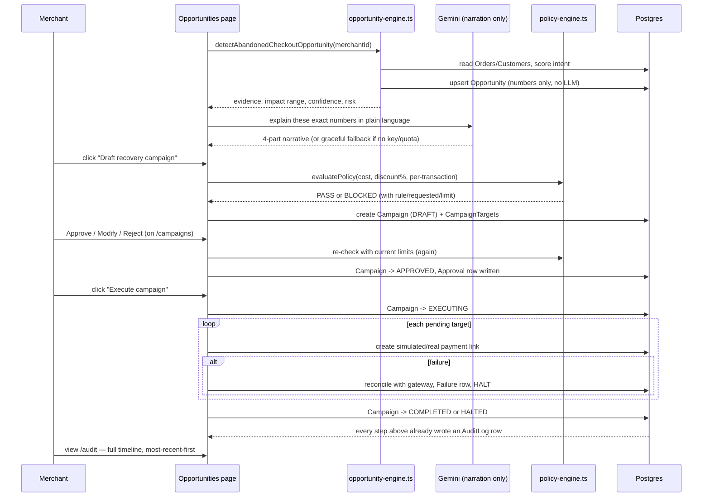
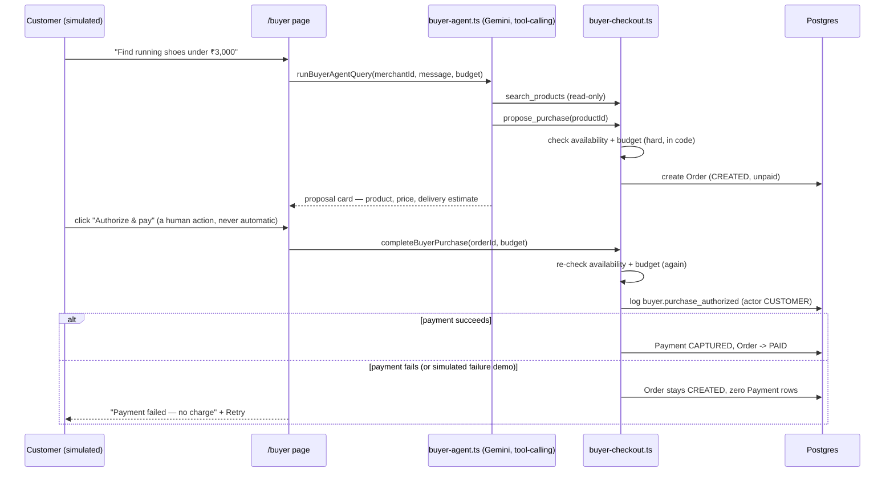

# UX Flows — Vriddhi

> Written retroactively at Phase 24, describing the flows as actually
> implemented (route names, component names, real states) rather than
> wireframe-stage intentions.

## Flow 1 — Detect → explain → approve → execute → audit (the core loop)

This is the product's central narrative: **AI insight → human action →
system record**. It's deliberately visible as three distinct visual
surfaces throughout the UI (see `docs/ARCHITECTURE.md` §UI conventions),
not just a backend concept.



**Real states a merchant can hit, and what's shown:**
- No abandoned checkouts yet → empty state on `/overview` and `/opportunities`, not a fake zero-value card.
- Opportunity detected, Gemini narration unavailable → the exact rule-based summary is shown instead, labeled "AI explanation unavailable — the Gemini API call failed. Showing the rule-based summary." (never silently hidden).
- Draft blocked by policy → the Opportunity card shows a red `BLOCKED` badge with the exact rule/requested/limit, and the draft button is effectively a no-op (the same policy check runs server-side regardless of what the button does).
- Campaign halted mid-execution → `/campaigns` shows the literal "ACTION FAILED" state: reason, a safety checklist (no duplicate transaction / no additional charge / action recorded), and a "Retry remaining N" button scoped to only the untouched targets.

## Flow 2 — Reversed direction: the AI buyer

A second, smaller agent that mirrors the same discipline from the other
side of the transaction — a shopper's AI, not the merchant's.



The agent's tool registry structurally has no "pay" tool — `propose_purchase`
can only create a pending order. Only a human clicking the button in the
browser can reach `completeBuyerPurchase`, and it re-validates everything
a second time rather than trusting what was true when the agent proposed it.

## Flow 3 — Cross-sell (no money involved)

Same detect→approve pattern as Flow 1, but deliberately *without* the
policy-engine step — approving a cross-sell recommendation only changes
what's suggested on a product page (`ProductCrossSell` row), so there's
no financial guardrail to check. This asymmetry is intentional: the
guardrail exists because money moves, not because "AI recommended
something" is inherently risky.

## Navigation map (as shipped)

```
/                    marketing landing (public)
/overview            merchant dashboard home
/opportunities       abandoned-checkout + cross-sell recommendations
/campaigns           draft / approve / execute / history
/agent               merchant-side chat (Gemini tool-calling)
/buyer               AI-buyer demo (reversed-direction agent)
/analytics           merchant / AI / financial-safety / business-impact metrics
/audit               full event timeline
/settings            policy limits (the only merchant-editable guardrail config)
/api/health          liveness + DB connectivity (JSON)
/api/catalog         public, unauthenticated product search (for external AI agents)
```

## Responsive / accessibility notes (Phase 22)

- Mobile nav is a slide-in drawer below the `lg` breakpoint; verified live
  (open/close, active-state highlighting) after an earlier session had
  left this unconfirmed due to a browser-automation-tool quirk, not an
  app bug.
- Every route-level page has its own `loading.tsx` skeleton and the
  `(app)` layout has an `error.tsx` boundary — neither existed before
  Phase 22.
- Focus rings render correctly on every interactive element via a single
  global `outline-color` rule rather than per-component styling.
